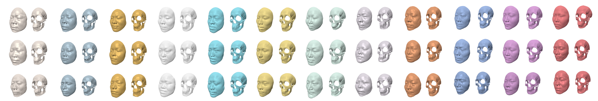

### Updated on August 12, 2025

This work accomplishes two core tasks: the retrieval of skull - corresponding faces and the similarity detection between skulls and faces. The highest accuracy of the retrieval can reach 99.45%. 

#### 3D Skull and Face Geometric Feature Mapping

This section focuses on extracting depth, curvature, and elevation features from 3D models. These features are then projected onto 2D feature maps, which serve as input for subsequent model training.

#### Metric Learning using Triplet Network

1. **Overview**
This part utilizes a triplet network for the task of skull - face matching. By incorporating triplet loss and Sinkhorn loss, the model can learn discriminative embeddings, which helps to improve the matching accuracy.

2. **Formulas**
    - **Triplet Loss**
      $$L_{Triplet}=\max\left(\left\|S_{a}-F_{p}\right\|^{2}-\left\|F_{a}-F_{n}\right\|^{2}+\text{margin}, 0\right)$$
    - **Sinkhorn Distance**
      $$W_{\epsilon}(S, F)=\min_{\pi \in \Pi(S, F)} \sum_{i = 1}^{n} \sum_{j = 1}^{m} \pi_{i j} M_{i j}+\epsilon H(\pi)$$
    - **Sinkhorn Loss**
      $$L_{Sinkhorn}=\max\left(\frac{W_{p}-W_{n}}{W_{p}+W_{n}+\delta}+\text{margin}, 0\right)$$

3. **Process**
The steps include building a triplet network, extracting features from the input data, calculating the triplet loss and Sinkhorn loss, and finally optimizing the network parameters through back - propagation. 

The code used for cranial superimposition is available here. After our paper is officially published, the trained weights and detailed implementation will be provided.

